# **Microservices Applications Attack and Detection**

## **Table of Contents**
1. [7.1 Prerequisites](#71-prerequisites)
2. [Installation Instructions](#installation-instructions)
   - [Environment Setup](#environment-setup)
   - [Provision Machines](#1-provision-machines)
   - [Set Up Jumpbox](#2-set-up-jumpbox)
   - [Set Up Cluster](#3-set-up-cluster)
   - [Configure Machines and Hostnames](#31-configure-machines-and-hostnames)
   - [Generate TLS Certificates](#32-generate-tls-certificates)
   - [Kubernetes Configuration Files](#33-generating-kubernetes-configuration-files-for-authentication)
   - [Set Up etcd Cluster](#34-set-up-the-etcd-cluster)
   - [Set Up Kubernetes Control Plane](#35-set-up-the-kubernetes-control-plane)
   - [Set Up Worker Nodes](#335-set-up-worker-nodes)
   - [Cluster DNS](#337-cluster-dns)
3. [Deploy the Online Boutique Application](#4-deploy-the-online-boutique-application)
4. [Install Sysdig & Chisel Scripts](#install-sysdig--chisel-scripts)
5. [Install ReplicaWatcher Tool](#install-replicawatcher-tool)
6. [Execution Steps](#execution-steps)
7. [Troubleshooting](#troubleshooting)
8. [7.2 Code Understanding](#72-code-understanding)
   - [Annotated Code Walkthrough](#annotated-code-walkthrough)
   - [Event Chunking](#event-chunking)
   - [Event Encoding](#event-encoding)
   - [Anomaly Detection](#anomaly-detection)
   - [Extensions or Insights](#extensions-or-insights)
9. [7.3 Implementation](#Implementation)

## **7.1 Prerequisites**

**Below are the list of technologies and necessary software:**

- Kubernetes (local deployment)  
- Sysdig (open-source version)  
- Docker (for containerized environments)  
- Chisel (Sysdig extension, Lua script)  
- Python  
- Replicawatcher (git repository)

### **Hardware Requirements**

**The following table lists the four machines required for the cluster, along with their CPU, memory, and storage specifications.**

| Name             | Role                             | IP Address     | CPU | RAM  | Storage | OS                               |
|------------------|----------------------------------|----------------|-----|------|---------|-----------------------------------|
| jumpbox          | Administration host              | 192.168.1.30   | 1   | 2GB  | 20GB    | Debian 12 (bookworm) AMD         |
| kubernetes-server| Kubernetes server (Control Plane)| 192.168.1.0    | 1   | 4GB  | 20GB    | Debian 12 (bookworm) AMD         |
| node-0           | Kubernetes worker node           | 192.168.1.199  | 3   | 10GB | 20GB    | Debian 12 (bookworm) AMD         |
| node-1           | Kubernetes worker node           | 192.168.1.48   | 3   | 10GB | 20GB    | Debian 12 (bookworm) AMD         |

>  **Minimum hardware requirements:** At least 1 vCPU and 2GB RAM per host. Worker nodes require a minimum of 3 vCPUs and 10GB RAM for smooth operation.


##	**Installation Instructions:**
We have followed famous kubernetes deployment for deploying self-hosted clusters (Kubernetes-the-hard-way). In addition, we have included changes to the implementation, modified the images of all nodes to AMD instead of AARCH64 as well as all downloaded applications listed in the repo AMD instead of AARCH64. 

### **	Environment setup **

#### **1. Provision Machines**
•	Install Debian 12 on all machines.
•	Configure SSH access and verify connectivity between all nodes.
•	Set hostnames as kubernetes-server, node-0, and node-1

#### **2. Set Up Jumpbox**

Install utilities and Kubernetes bash

#### **3. Set Up Cluster**

##### **3.1 Configure Machines and Hostnames**
Setting unique hostnames and enabling hostname-based communication between nodes simplifies cluster management. Updating the /etc/hosts file on all machines ensures they can communicate using hostnames instead of IP addresses, which is essential for Kubernetes components to operate seamlessly.
Steps:
**1.	Assign hostnames:**
hostnamectl set-hostname <hostname> 

Example hostnames:
	kubernetes-server.kubernetes.local for the control plane.
	node-0.kubernetes.local and node-1.kubernetes.local for worker nodes.

**2.	Update /etc/hosts on all machines:**

echo "<IP> kubernetes-server.kubernetes.local kubernetes-server" >> /etc/hosts 
echo "<IP> node-0.kubernetes.local node-0" >> /etc/hosts 
echo "<IP> node-1.kubernetes.local node-1" >> /etc/hosts 
 
##### **3.2 Generate TLS Certificates**
TLS certificates are crucial for securing communication between Kubernetes components, ensuring confidentiality, integrity, and mutual authentication. A Certificate Authority (CA) is created to sign all certificates, and individual certificates are generated for components like the API server, kubelet, and etcd.
Steps:
**1.	Create a Certificate Authority (CA):**

openssl genrsa -out ca.key 4096 
openssl req -x509 -new -key ca.key -days 1000 -out ca.crt -subj "/CN=kubernetes-ca" 

**2.	Generate client server certificates for each component within the cluster:**

Generate the certificates and private keys:
certs=(
"admin" "node-0" "node-1"
"kube-proxy" "kube-scheduler"
"kube-controller-manager"
"kube-api-server"
"service-accounts"
)

for i in ${certs[*]}; do
openssl genrsa -out "${i}.key" 4096

openssl req -new -key "${i}.key" -sha256 \
-config "ca.conf" -section ${i} \
-out "${i}.csr"

openssl x509 -req -days 3653 -in "${i}.csr" \
-copy_extensions copyall \
-sha256 -CA "ca.crt" \
-CAkey "ca.key" \
-CAcreateserial \
-out "${i}.crt"
done
The results of running the above command will generate a private key, certificate request, and signed SSL certificate for each of the Kubernetes components.

**3.	Distribute certificates to nodes:**

 
Copy the appropriate certificates and private keys to the node-0 and node-1 machines:
for host in node-0 node-1; do
  ssh root@$host mkdir /var/lib/kubelet/
  
  scp ca.crt root@$host:/var/lib/kubelet/
    
  scp $host.crt \
    root@$host:/var/lib/kubelet/kubelet.crt
    
  scp $host.key \
    root@$host:/var/lib/kubelet/kubelet.key
done
Copy the appropriate certificates and private keys to the kubernetes-server machine:
scp \
  ca.key ca.crt \
  kube-api-server.key kube-api-server.crt \
  service-accounts.key service-accounts.crt \
  root@kubernetes-server:~/

The kube-proxy, kube-controller-manager, kube-scheduler, and kubelet client certificates will be used to generate client authentication configuration files in the next lab.

##### **3.3 Generating Kubernetes Configuration Files for Authentication**

Configure Kubernetes clients to connect and authenticate to Kubernetes API Servers. These configuration files are crucial for enabling secure communication between the Kubernetes API Server and its components. Key steps include:

•	Creating kubeconfig files for each component: Generate configuration files for kubelet (e.g., node-0.kubeconfig, node-1.kubeconfig), kube-proxy (kube-proxy.kubeconfig), kube-controller-manager (kube-controller-manager.kubeconfig), kube-scheduler (kube-scheduler.kubeconfig), and admin (admin.kubeconfig), using the certificate authority (CA) and client certificates generated during the TLS Certificates lab.

•	Specifying cluster details: Each kubeconfig specifies the cluster information, credentials, and context for the respective component, ensuring proper authentication and authorization.

•	Distributing kubeconfig files: Copy the kubeconfig files to their respective worker nodes or controller instances (e.g., /var/lib/kubelet and /var/lib/kube-proxy on worker nodes) to establish secure communication.

•	Setting up data encryption: Generate a 32-byte encryption key and create an encryption-config.yaml file to encrypt Kubernetes Secrets at rest, ensuring data security within the cluster.

By following these steps, the Kubernetes components are securely configured to communicate with the API server.


##### **3.4 Set Up the etcd Cluster**
The etcd cluster serves as the backbone of the Kubernetes control plane, storing cluster state, configuration, and secrets. Setting up a highly available and secure etcd cluster ensures consistent and reliable access to this critical data.
Steps:


Install the etcd Binaries
Extract and install the etcd server and the etcdctl command line utility:
{
  tar -xvf etcd-v3.4.34-linux-arm64.tar.gz
  mv etcd-v3.4.34-linux-arm64/etcd* /usr/local/bin/
}
Configure the etcd Server
{
  mkdir -p /etc/etcd /var/lib/etcd
  chmod 700 /var/lib/etcd
  cp ca.crt kube-api-server.key kube-api-server.crt \
    /etc/etcd/
}
Each etcd member must have a unique name within an etcd cluster. Set the etcd name to match the hostname of the current compute instance:
Create the etcd.service systemd unit file:

mv etcd.service /etc/systemd/system/

Start the etcd Server

{
  systemctl daemon-reload
  systemctl enable etcd
  systemctl start etcd
}


 
##### **3.5 Set Up the Kubernetes Control Plane**
The control plane is the core of Kubernetes, responsible for managing the cluster and scheduling workloads. Setting up the API server, controller manager, and scheduler ensures the cluster can orchestrate workloads securely and efficiently.

Steps:
Install Kubernetes binaries on the control plane (kubernetes-server):

Connect to the jumpbox and copy Kubernetes binaries and systemd unit files to the kubernetes-server instance:
scp \
  downloads/kube-apiserver \
  downloads/kube-controller-manager \
  downloads/kube-scheduler \
  downloads/kubectl \
  units/kube-apiserver.service \
  units/kube-controller-manager.service \
  units/kube-scheduler.service \
  configs/kube-scheduler.yaml \
  configs/kube-apiserver-to-kubelet.yaml \
  root@kubernetes-server:~/
The commands in this lab must be run on the controller instance: kubernetes-server. Login to the controller instance using the ssh command. Example:
ssh root@kubernetes-server

Provision the Kubernetes Control Plane
Create the Kubernetes configuration directory:
mkdir -p /etc/kubernetes/config

Install the Kubernetes Controller Binaries
Install the Kubernetes binaries:
{
  chmod +x kube-apiserver \
    kube-controller-manager \
    kube-scheduler kubectl
    
  mv kube-apiserver \
    kube-controller-manager \
    kube-scheduler kubectl \
    /usr/local/bin/
}


Configure the API Server:

{
  mkdir -p /var/lib/kubernetes/

  mv ca.crt ca.key \
    kube-api-server.key kube-api-server.crt \
    service-accounts.key service-accounts.crt \
    encryption-config.yaml \
    /var/lib/kubernetes/
}
Create the kube-apiserver.service systemd unit file:
mv kube-apiserver.service \
  /etc/systemd/system/kube-apiserver.service


Configure the Kubernetes Controller Manager

Move the kube-controller-manager kubeconfig into place:

mv kube-controller-manager.kubeconfig /var/lib/kubernetes/

Create the kube-controller-manager.service systemd unit file:

mv kube-controller-manager.service /etc/systemd/system/


Configure the Kubernetes Scheduler

Move the kube-scheduler kubeconfig into place:

mv kube-scheduler.kubeconfig /var/lib/kubernetes/

Create the kube-scheduler.yaml configuration file:

mv kube-scheduler.yaml /etc/kubernetes/config/

Create the kube-scheduler.service systemd unit file:
mv kube-scheduler.service /etc/systemd/system/


Start the Controller Services
{
  systemctl daemon-reload
  
  systemctl enable kube-apiserver \
    kube-controller-manager kube-scheduler
    
  systemctl start kube-apiserver \
    kube-controller-manager kube-scheduler
}


 
##### **3.3.5 Set Up Worker Nodes**
Worker nodes host application containers and handle resource allocation. Configuring kubelet and kube-proxy on each node ensures they can manage workloads and integrate with the control plane.
Steps:
Install Kubernetes binaries on worker nodes (node-0 and node-1):
Copy Kubernetes binaries and systemd unit files to each worker instance:
for host in node-0 node-1; do
  SUBNET=$(grep $host machines.txt | cut -d " " -f 4)
  sed "s|SUBNET|$SUBNET|g" \
    configs/10-bridge.conf > 10-bridge.conf 
    
  sed "s|SUBNET|$SUBNET|g" \
    configs/kubelet-config.yaml > kubelet-config.yaml
    
  scp 10-bridge.conf kubelet-config.yaml \
  root@$host:~/
done
for host in node-0 node-1; do
  scp \
    downloads/runc.arm64 \
    downloads/crictl-v1.31.1-linux-arm64.tar.gz \
    downloads/cni-plugins-linux-arm64-v1.6.0.tgz \
    downloads/containerd-2.0.0-linux-arm64.tar.gz \
    downloads/kubectl \
    downloads/kubelet \
    downloads/kube-proxy \
    configs/99-loopback.conf \
    configs/containerd-config.toml \
    configs/kubelet-config.yaml \
    configs/kube-proxy-config.yaml \
    units/containerd.service \
    units/kubelet.service \
    units/kube-proxy.service \
    root@$host:~/
done
The commands must be run on each worker instance: node-0, node-1. Then 
Login to the worker instance using the ssh command. Example:
ssh root@node-0

The kubelet will fail to start if swap is enabled. It is recommended that swap be disabled to ensure Kubernetes can provide proper resource allocation and quality of service.
 
Swapoff -a

Create the installation directories:
mkdir -p \
  /etc/cni/net.d \
  /opt/cni/bin \
  /var/lib/kubelet \
  /var/lib/kube-proxy \
  /var/lib/kubernetes \
  /var/run/kubernetes
      Install the worker binaries:
{
  mkdir -p containerd
  tar -xvf crictl-v1.31.1-linux-arm64.tar.gz
  tar -xvf containerd-2.0.0-linux-arm64.tar.gz -C containerd
  tar -xvf cni-plugins-linux-arm64-v1.6.0.tgz -C /opt/cni/bin/
  mv runc.arm64 runc
  chmod +x crictl kubectl kube-proxy kubelet runc 
  mv crictl kubectl kube-proxy kubelet runc /usr/local/bin/
  mv containerd/bin/* /bin/
}
Configure CNI Networking
Create the bridge network configuration file:

mv 10-bridge.conf 99-loopback.conf /etc/cni/net.d/

Configure containerd
Install the containerd configuration files:

{
  mkdir -p /etc/containerd/
  mv containerd-config.toml /etc/containerd/config.toml
  mv containerd.service /etc/systemd/system/
}

Configure the Kubelet
Create the kubelet-config.yaml configuration file:

{
  mv kubelet-config.yaml /var/lib/kubelet/
  mv kubelet.service /etc/systemd/system/
}

Configure the Kubernetes Proxy
{
  mv kube-proxy-config.yaml /var/lib/kube-proxy/
  mv kube-proxy.service /etc/systemd/system/
}

Start the Worker Services

{
  systemctl daemon-reload
  systemctl enable containerd kubelet kube-proxy
  systemctl start containerd kubelet kube-proxy
}

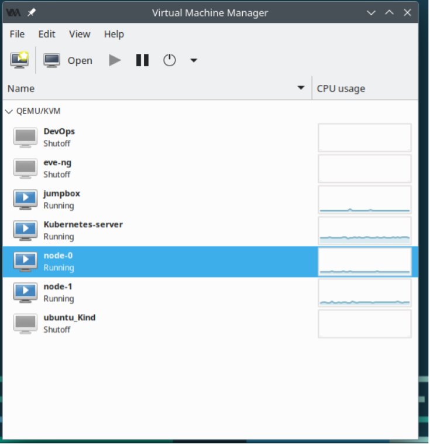

Figure 1: Cluster Deployment 

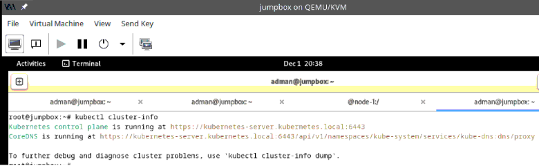

Figure 2: Cluster information

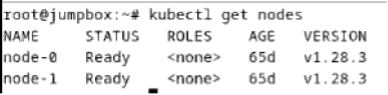

Figure 3: Cluster Working Nodes

##### **3.3.7 Cluster DNS**
The implementation of Kubernetes the hard way does not include ClusterDNS, which enables the one service to reach other services only by the name similar network DNS but on Microservices level. For that, Coredns pods had to be deployed on the cluster as well making Kube-dns service reachable on cluster. 

**1.	Deploying CoreDNS deployment using manifest which will create pods that handle the workload of DNS resolution:**
apiVersion: apps/v1
kind: Deployment
metadata:
  name: coredns
  namespace: kube-system
  labels:
    k8s-app: kube-dns
    kubernetes.io/name: "CoreDNS"
spec:
   replicas: not specified here:
   1. Default is 1.
   2. Will be tuned in real time if DNS horizontal auto-scaling is turned on.
  strategy:
    type: RollingUpdate
    rollingUpdate:
      maxUnavailable: 1
  selector:
    matchLabels:
      k8s-app: kube-dns
  template:
    metadata:
      labels:
        k8s-app: kube-dns
    spec:
      priorityClassName: system-cluster-critical
      serviceAccountName: coredns
      tolerations:
        - key: "CriticalAddonsOnly"
          operator: "Exists"
      nodeSelector:
        kubernetes.io/os: linux
      affinity:
         podAntiAffinity:
           preferredDuringSchedulingIgnoredDuringExecution:
           - weight: 100
             podAffinityTerm:
               labelSelector:
                 matchExpressions:
                   - key: k8s-app
                     operator: In
                     values: ["kube-dns"]
               topologyKey: kubernetes.io/hostname
      containers:
      - name: coredns
        image: coredns/coredns:1.8.0
        imagePullPolicy: IfNotPresent
        resources:
          limits:
            memory: 170Mi
          requests:
            cpu: 100m
            memory: 70Mi
        args: [ "-conf", "/etc/coredns/Corefile" ]
        volumeMounts:
        - name: config-volume
          mountPath: /etc/coredns
          readOnly: true
        ports:
        - containerPort: 53
          name: dns
          protocol: UDP
        - containerPort: 53
          name: dns-tcp
          protocol: TCP
        - containerPort: 9153
          name: metrics
          protocol: TCP
        securityContext:
          allowPrivilegeEscalation: false
          capabilities:
            add:
            - NET_BIND_SERVICE
            drop:
            - all
          readOnlyRootFilesystem: true
        livenessProbe:
          httpGet:
            path: /health
            port: 8080
            scheme: HTTP
          initialDelaySeconds: 60
          timeoutSeconds: 5
          successThreshold: 1
          failureThreshold: 5
        readinessProbe:
          httpGet:
            path: /ready
            port: 8181
            scheme: HTTP
      dnsPolicy: Default
      volumes:
        - name: config-volume
          configMap:
            name: coredns
            items:
            - key: Corefile
              path: Corefile

**2.	Creating Kube-DNS to make the DNS service only accessible to all services through one ClusterIP**

apiVersion: v1
kind: Service
metadata:
  name: kube-dns
  namespace: kube-system
  annotations:
    prometheus.io/port: "9153"
    prometheus.io/scrape: "true"
  labels:
    k8s-app: kube-dns
    kubernetes.io/cluster-service: "true"
    kubernetes.io/name: "CoreDNS"
spec:
  selector:
    k8s-app: kube-dns
  clusterIP: 192.168.122.10
  ports:
  - name: dns
    port: 53
    protocol: UDP
  - name: dns-tcp
    port: 53
    protocol: TCP
  - name: metrics
    port: 9153
    protocol: TCP

**3.	Implementing ConfigMap manifest to specify the dns configuration file and content which will be loaded to created coredns pods.**
apiVersion: v1
kind: ConfigMap
metadata:
  name: coredns
  namespace: kube-system
data:
  Corefile: |
    .:53 {
        errors
        health {
          lameduck 5s
        }
        ready
        kubernetes cluster.local in-addr.arpa ip6.arpa {
          fallthrough in-addr.arpa ip6.arpa
        }
        prometheus :9153
        forward . /etc/resolv.conf {
          max_concurrent 1000
        }
        cache 30
        loop
        reload
        loadbalance
    }

**4.	Creating ClusterRole and ClusterRoleBinding to define the access level of DNS pods to Kubernetes API**

apiVersion: rbac.authorization.k8s.io/v1
kind: ClusterRole
metadata:
  labels:
    kubernetes.io/bootstrapping: rbac-defaults
  name: system:coredns
rules:
- apiGroups:
  - ""
  resources:
  - endpoints
  - services
  - pods
  - namespaces
  verbs:
  - list
  - watch

apiVersion: rbac.authorization.k8s.io/v1
kind: ClusterRoleBinding
metadata:
  annotations:
    rbac.authorization.kubernetes.io/autoupdate: "true"
  labels:
    kubernetes.io/bootstrapping: rbac-defaults
  name: system:coredns
roleRef:
  apiGroup: rbac.authorization.k8s.io
  kind: ClusterRole
  name: system:coredns
subjects:
- kind: ServiceAccount
  name: coredns
  namespace: kube-system

**5.	Creating ServiceAccount to be used by CoreDNS pods to interact with kubernetes API**

apiVersion: v1
kind: ServiceAccount
metadata:
  name: coredns
  namespace: kube-system

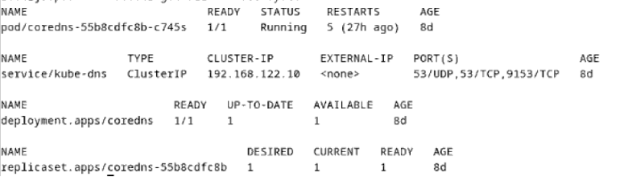

 Figure 4: DNS Configuration Result

6.	Mounting br_netfilter kernel module
modprobe br_netfilter


## **4.	Deploy the Online Boutique Application**
1.	Clone Application Repository
git clone https://github.com/GoogleCloudPlatform/microservices-demo.git
2.	Deploy Application
kubectl apply -f release/kubernetes-manifests.yaml

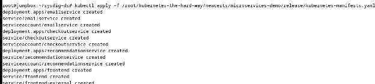

 Figure 5: GOB deployment

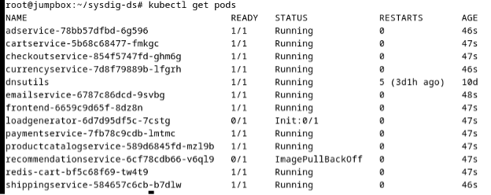

 Figure 6: Deployed pods

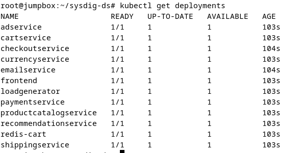

Figure 7: Deployed services


Figure 8: Application Interface (Through frontend service)


## **Install Sysdig & Chisel Scripts**
The deployment of sysdig on the Kubernetes cluster was tricky as it was not thoroughly explained as part of the paper. In addition, as sysdig is a free utility that to be used by anyone and deployed as system level application or as container through a cluster, it also has many commercial applications and features part of it. 

1.	Cloneing ReplicaWatcher repo into jumpbox to acquire chisels scripts
Git clone https:// https://github.com/utwente-scs/ReplicaWatcher.git 

2.	Sysdig image by default does not include ReplicaWatcher chisels scripts inside it, so we have to create a configMap to compose chisels script into the pods that will be deployed by daemonset
Kubectl create configMap Replicawatcher-chisels –from-file=chisels/*

3.	created sysdig daemonset to deploy sysdig on every working node and monitor the pods activities on kernel level to get the generated events and save it locally on working nodes. Deployment includes all mounts that sysdig should have access to and also mount of configMap to mount chisels. It also includes the bash commands we used to auomate the collection process.

apiVersion: apps/v1  
kind: DaemonSet
metadata:
  name: sysdig
  labels:
    app: sysdig
spec:
  selector:
    matchLabels:
      name: sysdig
  template:
    metadata:
      labels:
        name: sysdig
    spec:
      volumes:
      - name: containerd-sock
        hostPath:
         path: /var/run/containerd/containerd.sock
         type: Socket
      - name: dev-vol
        hostPath:
         path: /dev
      - name: proc-vol
        hostPath:
         path: /proc
      - name: boot-vol
        hostPath:
         path: /boot
      - name: modules-vol
        hostPath:
         path: /lib/modules
      - name: usr-vol
        hostPath:
          path: /usr
      - name: chisels
        configMap:
          name: replicawatcher-chisels
      - name: sysdig-collection
        hostPath:
          path: /root/sysdig/collection
      - name: tmp-vol
        hostPath:
          path: /tmp
      hostNetwork: true
      hostPID: true
      containers:
      - name: sysdig
        image: sysdig/sysdig:0.38.1
        command: ["/bin/bash","-c","cd /host/tmp/; while true; do sysdig -M 10 -c replicawatcher.lua 'cartservice sysdig_capture.json';sleep 590;done"]
        securityContext:
         privileged: true
        env:
 
        volumeMounts:
        - mountPath: /host/var/run/containerd/containerd.sock
          name: containerd-sock
          readOnly: false
        - mountPath: /host/dev
          name: dev-vol
          readOnly: false
        - mountPath: /host/proc
          name: proc-vol
          readOnly: true
        - mountPath: /host/boot
          name: boot-vol
          readOnly: true
        - mountPath: /host/lib/modules
          name: modules-vol
          readOnly: true
        - mountPath: /host/usr
          name: usr-vol
          readOnly: true
        - mountPath: /host/tmp
          name: tmp-vol
          readOnly: false
        - mountPath: /usr/share/sysdig/chisels
          name: chisels
          readOnly: false

## **Install ReplicaWatcher Tool**
1.	Collection of generated logs to monitoring node (jumpbox) through cronjob scripts to collection directory /home/adman/collection/


Figure 9: Collection cronjobs from both nodes

2.	Running the detection scripts on the collected logs
python3 replicawatcher.py /home/adman/collection

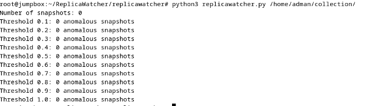

Figure 10: Running Replicawatcher on collected logs


## **Execution Steps**
Execution steps are detailed within each setup subsection above.


## **Troubleshooting**


| Challenge | Status | Resolution |
|----------|--------|------------|
| GKE cost | Resolved | Moved to self-hosted Kubernetes |
| AARCH64 image incompatibility | Resolved | Used AMD-compatible versions |
| IP misconfiguration in PKI | Resolved | Corrected and rebuilt PKI |
| Missing DNS setup | Resolved | Added complete DNS configuration |
| DNS on workers | Resolved | Loaded kernel module |
| Static route persistence | Resolved | Configured interfaces file |
| Missing structure in paper | Resolved | Created architecture based on paper and repo |
| Commercial sysdig confusion | Resolved | Used open-source sysdig version |
| Missing DaemonSet | Resolved | Created manually with automation |
| Chisel integration unclear | Resolved | Used ConfigMap to inject scripts |
| Collection method missing | Resolved | Used cronjobs for transfer |
| Missing attack detail | Resolved | Modeled based on CWEs |
| Empty sysdig logs | Not Resolved | Suspected metadata enrichment missing |

---

**Details** 
1.	Initial we built the application with different accounts at google cloud (GKE) but it is costly (cost around 40 $ in two days)	Resolved 
•	Moving to self-hosting Kubernetes
2.	All images and application packages in Kubernetes-the-hard-way was aarch64 which is not compatible with AMD	Resolved
•	Locate all corresponding amd packages.
•	Insert  them into the automation process
3.	Kubernetes-the-hard-way is missing the appropriate steps in modifying IP address range which results in misconfigurations of PKI	Resolved
•	Modification of IP address in configuration file
•	Rebuild PKI
4.	Kubernetes-the-hard-way dose not include DNS configuration that result in application services communication issues	Resolved
•	Configure complete DNS
5.	Working Nodes does not include configuration needed for DNS resolution	Resolved
•	Loading br_netfilter kernel module
6.	Kubernetes-the-hard-way dose not include permanent configuration of static routes	Resolved
•	Configured static route permanently in interfaces file
7.	Paper includes only the chisels filtering code and anomaly detection script without any proper details about the structure of the solution	Resolved
•	Trying many agent types and different configurations then construct an architecture for collection depending on the information provided in paper and github.
8.	Paper mentions the use of sysdig, however sysdig is a commercial company that has many products	Resolved
•	Used sysdig the opensource utility which is mentioned in replicwatcher github
9.	Paper dose not include the daemonset configuration of sysdig	Resolved
•	We created daemonset based on sysdig github repo script and modified the running command to run to run the collection command
10.	 Paper dose not include how chisels is integrated with sysdig daemonset	Resolved
We created configMap to include the chisels scripts in container in order to run the sysdig with scripts
11.	 Paper mentions the data is collected to an anlyzing host where the replicawatcher.py is ran however nothing about the collection method used.	Resolved
•	We used cronjob to transfer the output files to monitoring station.
12.	 Paper dose not include the details of attacks used	Resolved
•	We modeled the attacked based on given CWEs
13.	 Collected json capture of sysdig are empty	Not Resolved
We suspect that sysdig have many agents, many of which (sysdig/sysdig or sysdig/agent) sysdig/sysdig is the opensource version which collects the raw capture of system calls and enable the usage of chisels. On the other hand, sysdig/agent enable k8s metadata enrichment which enable the system calls to be mapped in Kubernetes details such as (pod_name, services,… etc). Upon trying the sysdig/agent an error raised that it is missing the CusomerID which enable the service to be integrated with backend sysdig products. 
 
**Which means in order to have replicawatcher running we need the chisels to run and the chisels can run only if the output of sysdig is parsed against Kubernetes details. **


## **7.2 Code Understanding**

### **Annotated Code Walkthrough**

**•	Sysdig **
Sysdig captures system calls and other operating system events by deploying a kernel module or eBPF probe, which intercepts these calls directly from the Linux kernel. This approach allows Sysdig to monitor system activities in real-time, providing comprehensive insights into process behaviors, file operations, and network interactions. https://github.com/draios/sysdig?utm_source=chatgpt.com 


**•	Chiesl scripts**
In the ReplicaWatcher project, custom Chisel scripts are developed to capture relevant events from replicas, focusing on system calls that reflect operational states and send it to replicawathcher in json format .

**•	Replicawatcher**
This data is then fed into ReplicaWatcher anomaly detection logic, which compares the behavior of identical replicas to identify deviations. By assuming that replicas performing the same tasks should exhibit similar behaviors, ReplicaWatcher analyzing discrepancies among replicas performing similar functions, it identifies anomalies without relying on pre-established baselines
Replicawatcher Logic( how it detect anomaly in technical sound)

Replicawatcher designed to detect anomalies in replicas 

**The logic of Replicawatcher consist of  three main stages: **

•	Event Chunking
•	Event Encoding,
•	Anomaly Detection. 

Each stage uses specific algorithms and techniques to process replica activity data without relying on a training phase.

### **Event Chunking**

In this stage, Replicawatcher uses  the captured syscalls from Sysdig with a customized Chisel script to analyze kernel-level events. These events include filesystem interactions, executed commands, and system calls. The captured events are divided into time-bound snapshots, each describing the activities of replicas during a predefined interval (τsnapshot) 

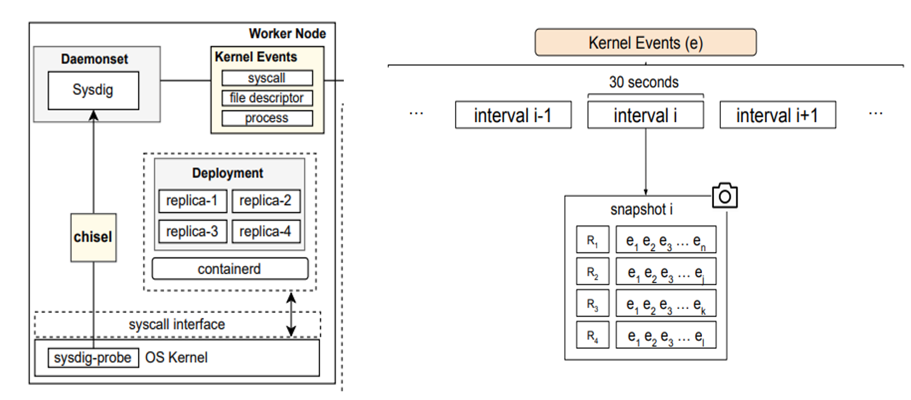


–	Initialization callback to initializes the event fields and sets filters for monitoring a specific deployment
function on_init()
    f_pod_name = chisel.request_field(fields.pod_name)
    f_timestamp = chisel.request_field(fields.timestamp)
    f_syscall_name = chisel.request_field(fields.syscall_name)
    f_syscall_category = chisel.request_field(fields.syscall_category)
    f_file_path = chisel.request_field(fields.file_path)
    f_file_name = chisel.request_field(fields.file_name)
    f_file_directory = chisel.request_field(fields.file_directory)
    f_file_operation = chisel.request_field(fields.file_operation)
    f_proc_name = chisel.request_field(fields.proc_name)
    f_proc_cmdline = chisel.request_field(fields.proc_cmdline)
    f_proc_cwd = chisel.request_field(fields.proc_cwd)
    f_proc_exe = chisel.request_field(fields.proc_exe)
    f_proc_args = chisel.request_field(fields.proc_args)

    -- Set filter 
    deployment_filter = "k8s.deployment.name=" .. deployment
    chisel.set_filter(deployment_filter)

    return true
end


–	Event parsing callback. Captures and processes each kernel event, extracting details such as pod name, timestamp, and syscall name.
function on_event()
    table.insert(list_of_pods, evt.field(f_pod_name))
    table.insert(events, {
        evt.field(f_pod_name),
        evt.field(f_timestamp),
        evt.field(f_syscall_name),
        evt.field(f_syscall_category),
        evt.field(f_file_path),
        evt.field(f_file_directory),
        evt.field(f_file_name),
        evt.field(f_file_operation),
        evt.field(f_proc_name),
        evt.field(f_proc_cmdline),
        evt.field(f_proc_cwd),
        evt.field(f_proc_exe),
        evt.field(f_proc_args)
    })
    return true
end

–	Capture end callback  to Encodes the accumulated events into JSON format and writes the output to a specified file.

function on_capture_end()
    local result = parse.parse(events, list_of_pods)
    local success, replicasEvents = pcall(json.encode, result, { indent = true })
    if not success then
        print("Error encoding JSON: " .. replicasEvents)
        return false
    end

    --print(replicasEvents)

    -- Writing to the output file
    local success, err = cutils.write_to_file(output_file, replicasEvents)
    if not success then
        print(err)
        return false
    else 
        print("File '" .. output_file .. "' has been successfully generated.")
    end
    return true    
end


### **Event Encoding**

This stage processes the captured events from the previous stage and encodes them into structured representations. The primary goal is to extract meaningful patterns by defining disimlirity scores from raw data that allow replicas to be compared effectively and to ensures that Replicawatcher can identify anomalies while minimizing false positives.

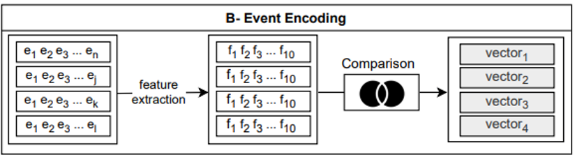

 
The stage will take the captured json file to multiple steps to process it :
–	Preprocess  involves extracting key attributes from the raw event data for subsequent analysis, such as syscalls, file operations, and process metadata.  This step consider as feature selection to ensure the data filtered from noise , duplicate features , and normalize paths.

def preprocess_data(data): 
aspects = ["syscalls", "directories", "filenames"] 
for replica in data: 
for key in aspects:
 if key in replica: replica[key] = list(set(replica[key])) 

–	Dissimilirity caculation :in this step Replicawatcher ReplicaWatcher calculates dissimilarity scores for each feature using Jaccard Similarity. This score measures how similar the features of a replica to other replicas.

Jaccard Similarity Formula:

 

Here how it is implemented in python: utils.py


def jaccard_similarity(set1, set2):
    intersection = set1.intersection(set2)
    union = set1.union(set2)
    return len(intersection) / len(union)

def dissimilarity(current_replica_set, other_replica_sets):
    if not current_replica_set:
        return 0
    similarity_scores = [jaccard_similarity(current_replica_set, s) for s in other_replica_sets]
    avg_similarity_score = sum(similarity_scores) / len(similarity_scores)
    return 1 - avg_similarity_score

–	Vector representation : then For each replica, the dissimilarity scores of all features are combined into a dissimilarity vector:

def calculate_replicas_vectors(self, data):
        """Calculate vectors for each replica based on the pre-defined aspects."""
        num_replicas = len(data)
        replicas_vectors = np.zeros((num_replicas, len(ASPECTS)))

        for i, aspect in enumerate(ASPECTS):
            replica_sets = self.calculate_replicas_sets(data, aspect)
            for j, current_set in enumerate(replica_sets):
                other_sets = replica_sets[:j] + replica_sets[j+1:]
                replicas_vectors[j, i] = dissimilarity(current_set, other_sets)

        return replicas_vectors


### **Anomaly Detection**

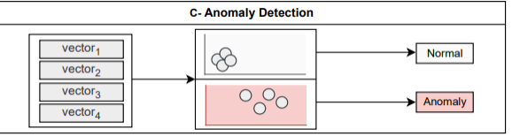


This is the final stage to give decision on the replicas behavior by evaluating the dissimilarity vectors. It assumes that normal replicas have similar behaviors, and anomalies are identified as replicas whose vectors deviate significantly from the expected pattern, as measured by their distance from the origin of the vector space or from other replicas.

**At this stage Replicawatcher will decide the legitimately of the behavior based on the following:**

1-	Encoded each replicas into a dissimilarity vector where each element corresponds to the dissimilarity score for a specific feature such as syscalls, directories accessed. 
2-	Using Euclidean distance to measure the deviation of a replica’s dissimilarity vector from the origin (representing normal behavior) where a higher distance indicates greater deviation from expected behavior, suggesting an anomaly.

3-	Classifying replicas as anomalous or normal, we apply a threshold to the calculated distances. 


def detect_anomalies(self, replicas_vectors, threshold):
        """Detect anomalies in the replicas vectors based on a threshold."""
        centroid = np.zeros((1, replicas_vectors.shape[1]))
        distances = cdist(replicas_vectors, centroid, 'euclidean').flatten()
        return np.any(distances > threshold)

    def run_detection(self):
        """Run the anomaly detection process for all JSON files in the folder."""
        print(f"Number of snapshots: {len(self.json_files)}")
        for threshold in np.arange(0.1, 1.1, 0.1):
            files_with_anomalies = sum(self.process_file(f, threshold) for f in self.json_files)
            self.num_files_with_anomalies[threshold] = files_with_anomalies
            print(f"Threshold {threshold:.1f}: {files_with_anomalies} anomalous snapshots")


### **Extensions or Insights**
– Propose potential improvements, such as:
•	Optimizing memory usage.
•	Enhancing detection accuracy.
•	Adding additional functionality to handle edge cases or improve runtime performance.

ReplicaWatcher significantly enhances detection accuracy through its innovative, training-less anomaly detection approach. Here is how:

•	Elimination of Training Dependence: Unlike state of the art anomaly detection systems for containerized microservice environment, ReplicaWatcher does not rely on pre-trained baselines, which are prone to obsolescence in dynamic environments. Instead, it leverages runtime comparisons of identical replicas to detect deviations, eliminating the need for retraining and ensuring robust performance over time.

•	Replica Behavior Analysis: The approach assumes that replicas, under normal operations, exhibit similar behavior. By monitoring their activities, anomalies caused by attacks or misconfigurations stand out as deviations, which are promptly flagged.

•	Noise Management: The system is designed to handle operational noise, such as fluctuations in user interactions or workloads, by focusing on features resilient to these variabilities. This ensures a low rate of false positives.

•	Efficiency and Scalability: ReplicaWatcher imposes minimal processing overhead, leveraging carefully selected features such as syscalls, file operations, and process metadata to maintain a balance between computational efficiency and detection capabilities. This makes it well-suited for high-traffic, real-world deployments.

•	Superior Detection Metrics: Achieving an average precision of 91.08% and a recall of 98.35%, ReplicaWatcher matches the performance of leading training-based solutions without the challenges of model maintenance and retraining.

 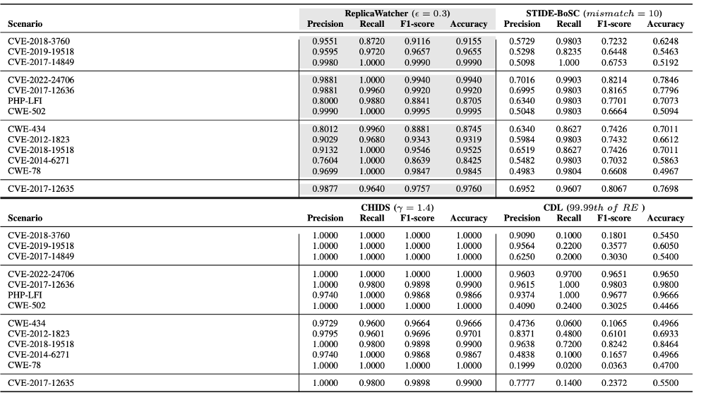


•	Adaptability to Shifting Norms: The system is inherently resilient to normality shifts, such as those caused by software updates, which can often degrade the performance of conventional systems. ReplicaWatcher adapts effortlessly, maintaining consistent detection accuracy without manual recalibration.


 #### **• Flow Diagram:**
high-level flow diagram of the code’s workflow:

 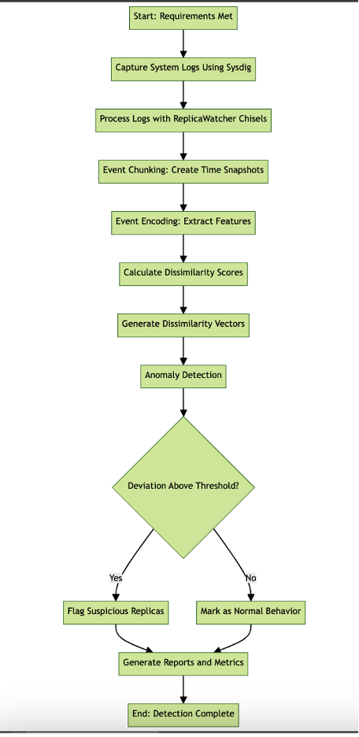


 

## **7.3 Implementation**

Implementation of the system includes system implementation details, after that the testing results of baseline paper ReplicaWatcher. Then, We profiled the normal and malicious behavior of the tested pods from the system calls collected by Sysdig. At the end, we implemented an autoencoder model and trained it to detect anomalies.


### **7.3.1 System Implementation Details:**
In order to replicate the results of ReplicaWatcher paper we had to implement the system that will host the GOB to be tested and validated.  First, we started by deploying Kubernetes cluster using self-hosted workstation with virtualization. The setup includes 4 nodes (VMs), Jumpbox for controlling the cluster, Kubernetes-server as control plane of the cluster and two working nodes. All hosts are deployed on (KVM) linux virtualization software and assigned local IP addresses on virtual switch by the hypervisor.   

 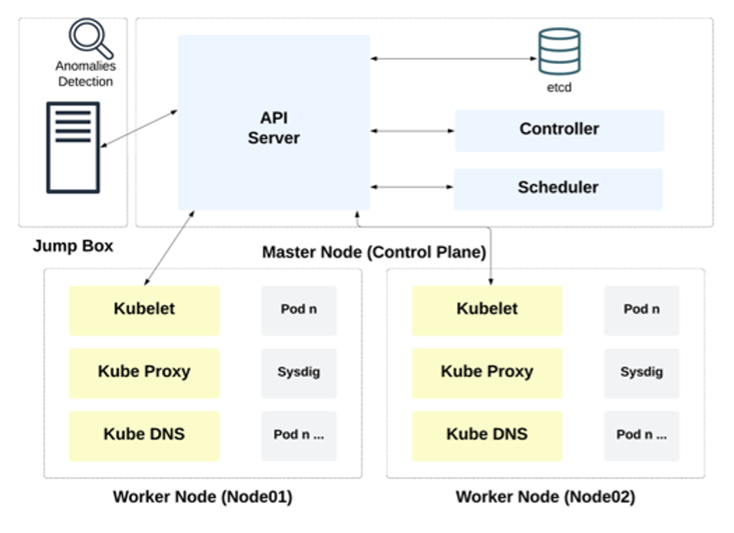

 After that we have provisioned PKI to secure communication between all cluster components. Microservices could communicate using the services name, however it requires to setup Kubernetes DNS service thus we deployed CoreDNS and its all-related configurations. Another configuration that has been realized after troubleshooting is to load br_netfilter kernel module to enable the bridging virtual network cards. 

 
 

Figure 1: Cluster Deployment 


Figure 2: Cluster information


Figure 3: Cluster Working Nodes


### ** 7.3.2 Application Deployment**

There are multiple applications designed to test the implementation of microservice applications and to be used in microservices benchmarking. The baseline paper we chose have used Google Online Boutique (GOB) and an application that they have developed internally but they have not released it. We preferred to proceed with GOB however it is mainly static, therefore we introduce another benchmarking application such as Teastore. We cloned the GOB application then applied the kubernetes-manifest.yaml


Figure 7: Deployed services


Figure 8: Application Interface (Through frontend service)

For **Teastore** we applied the manifest directly from Github using the below command
kubectl create -f

[View teastore-clusterip.yaml](teastore-clusterip.yaml)

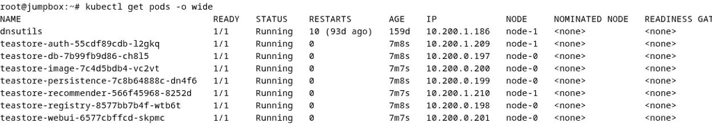

Teastore provisioned pods 

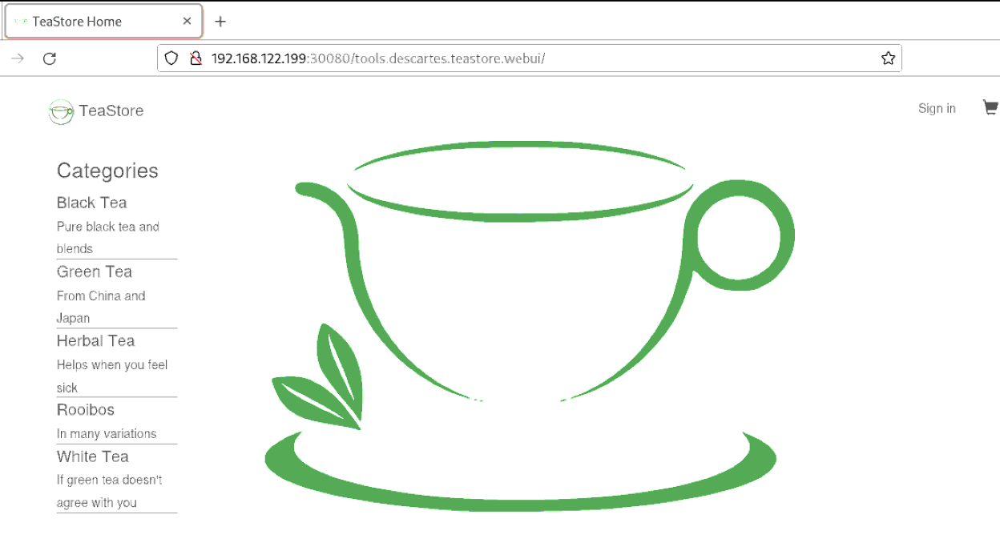

Teastore Web view

Unlike GOB, Teastore does not include load generator service which is needed to model the normal behavior of application. For that we have used Locust, an open-source testing application that generates a legitimate HTTP load. We have configured the locust file to generate legitimate traffic to all application services.

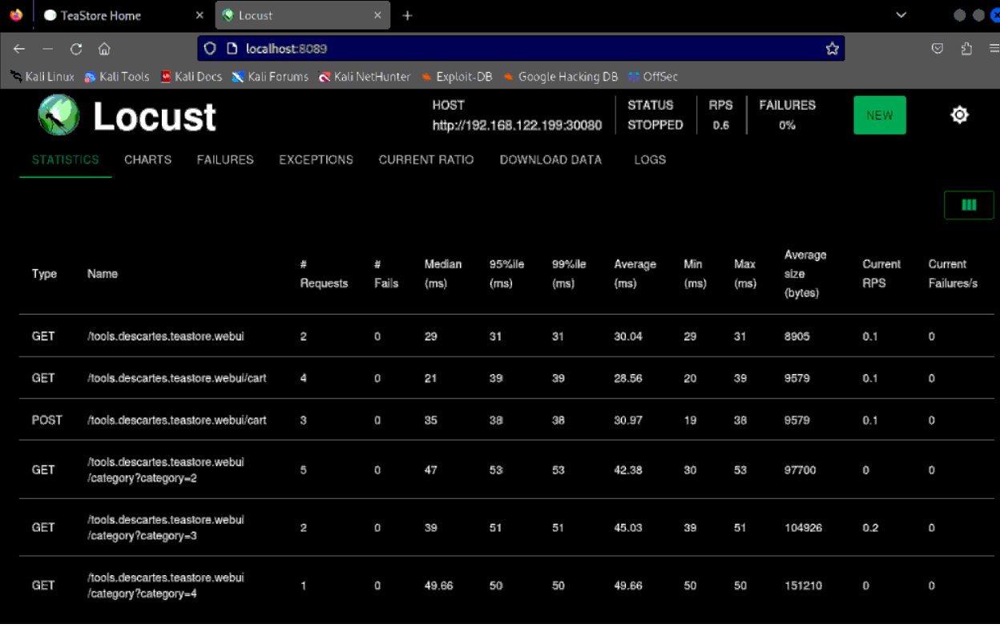

Locust load generator for Teastore


```python
from locust import HttpUser, task, between
import random
import string

class TeaStoreUser(HttpUser):
    wait_time = between(1, 3)

    def on_start(self):
        # Occasionally register a new user instead of reusing existing ones
        if random.random() < 0.03:  # 3% chance (~1 in 30)
            self.username, self.password = self.register_user()
        else:
            self.username, self.password = self.random_existing_user()
        self.login()

    def random_existing_user(self):
        users = [("alice", "alice123"), ("bob", "securepass"), ("charlie", "welcome1")]
        return random.choice(users)

    def register_user(self):
        # Randomly generate a unique user
        username = 'user' + ''.join(random.choices(string.ascii_lowercase + string.digits, k=6))
        password = 'pass' + ''.join(random.choices(string.ascii_letters + string.digits, k=8))

        # Register the user
        self.client.post("/tools.descartes.teastore.webui/register", data={
            "referer": "http://192.168.122.199:30080/",
            "username": username,
            "password": password,
            "passwordRepeat": password
        })
        return username, password

    def login(self):
        self.client.post("/tools.descartes.teastore.webui/loginAction", data={
            "referer": "http://192.168.122.199:30080/",
            "username": self.username,
            "password": self.password,
            "signin": "Sign in"
        })

    @task(3)
    def home_page(self):
        self.client.get("/tools.descartes.teastore.webui")

    @task(5)
    def browse_categories(self):
        category = random.randint(2, 6)
        self.client.get(f"/tools.descartes.teastore.webui/category?category={category}")

    @task(4)
    def add_to_cart(self):
        product = random.randint(0, 20)
        self.client.post("/tools.descartes.teastore.webui/cart", data={
            "add": product,
            "quantity": 1
        })

    @task(2)
    def view_cart(self):
        self.client.get("/tools.descartes.teastore.webui/cart")

    @task(1)
    def checkout(self):
        self.client.post("/tools.descartes.teastore.webui/order", data={
            "order": "true"
        })

    @task(1)
    def logout(self):
        self.client.get("/tools.descartes.teastore.webui/logout")
        self.login()  # Log in again to simulate session reuse

```


### ** 7.3.3 Attacks Simulation**

One of the clear limitation of replicawatcher that is also identified by the publications is the inability of the used training-less method of detecting uniform and brute force attacks. We will simulate a couple of attacks as descriped in the below table.


| Attack Type             | Reference CWE | Targeted Service   | Implementation |
|-------------------------|----------------|--------------------|----------------|
| **Brute Force Login**   | CWE-307        | Teastore-auth      | <pre>hydra -l Testtt -P rockyou1.txt 192.168.122.199 -s 30080 http-post-form \
"/tools.descartes.teastore.webui/loginAction:username=^USER^&password=^PASS^&referer=http%3A%2F%2F192.168.122.199%3A30080%2F&signin=Sign+in:F=302" \
-vV -t 4</pre> |
| **Directory Traversal** | CWE-022        | frontend           | <pre>curl "http://&lt;teastore-ip&gt;:30080/tools.descartes.teastore.imageprovider/rest/image/../../../etc/passwd"</pre> |
| **Denial of Service (DoS)** | CWE-400    | Teastore-WebUI     | <pre>seq 1 1000 \| xargs -n1 -P100 curl -s \
"http://192.168.122.199:30080/tools.descartes.teastore.webui/rest/products" &gt; /dev/null</pre> |


### ** 7.3.4 ReplicaWatcher Implementation**

Replicawatcher consists of two main components, one collection component used as part of daemonset that collects system calls in snapshots of 30 seconds. Another component is the analysis using Jaccard intersection to analyze system calls vector collected by the first component. We implemented a system of collection using cronjobs at the jumpbox to SSH into the worker nodes collecting snapshots of system calls that are collected by Sysdig.  In addition, the target pods to be tested throughout the attacks is frontend, therefore it needed to be scaled up to 4 replicas to compare pod’s behavior to another. And we modified the replicawatcher chisel to fix the filtering and enable the collection, below is an example of collected snapshot using Sysdig with replicawatcher chisel

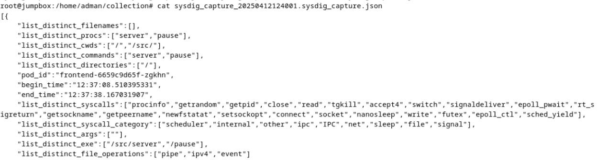

System calls snapshot collected by sysdig


The anomaly detection component of Replicawatcher encodes the collected information of Sysdig into vectors then the Jaccard intersection is calculated to find which pod is behaving abnormally. We applied a directory traversal attack on the frontend service while the collection is running and the below had resulted of replicawatcher. 

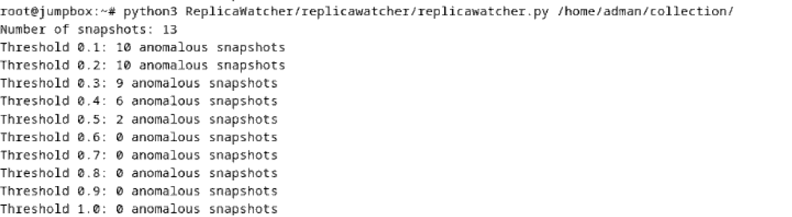

Result of directory traversal attack


The results show that there are still many noises which affect the anomaly detection application on the small threshold. After many attempts the most accurate threshold is between 0.5 and 0.6. 
Next, we tested the Replicawatcher with Brute force attack against Teastore-auth service which we scaled-up to 4 pods.  We tested the brute force attack once before the attack and during the attack and it shows the following

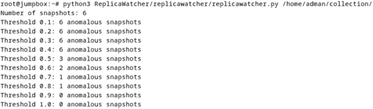

Analyzing the collected snapshots before executing the brute force attack


Analyzing the collected snapshots that includes the brute force attack

It also proves the limitation replicawatcher in detecting the brute force attack and the noise persists during the attack. 
And lastly, we tested the DoS attack on the Teastore-Webui after scaling up the webui pods to 4. below shows the status of Replicawatcher


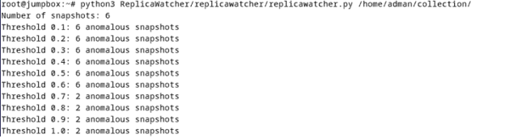

Analyzing the collected snapshots before executing the DoS attack


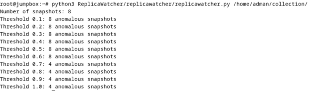

Analyzing the collected snapshots that includes the DoS attack


Also in DoS, Replicawatcher shows inaccuracy and huge noise that adds an anomaly with every snapshot added. To conclude the Replicawatcher in all 3 attacks shows a lot of noise and discrepancies and is unable to detect attacks and especially the uniform attacks such as brute force and DoS. Furthermore, if anomaly is detected by Replicawatcher  is unable to identify the infected pod due to the symmetrical Jaccard intersection.


### ** 7.3.4 Malicious Behavior Profiling**

Analyzing the malicious behavior’s impact on system is crucial, thus we chose to analyz the impact of Directory Traversal and Brute Force attacks on the system. 
We have collected two datasets using Sysdig from the frontend service in two modes to understand the behavior of the pods; during normal operations and during attack.

**•	Normal operation data (collection_no_attack_DT.csv): 22,254 system call records**
**•	During-attack Directory Traversal data (collection_with_attack_DT.csv): 18,648 system call records**

We have analyzed the frequency of system calls in both cases and it shows that the frequency is still largely dominated with the normal workload (wait epoll, thread synchronization, and I/O), however, there were notable differences. First, the are some system calls that are shown in normal operations and upsent during the attack such as socket(), connect(), getpeername(). Second, there are system calls that are present with high presence during the attack in contrast to normal operation getpid(), tgkill(), signaldeliver(), rt_signature(). And finally, sched_yield() system call experienced drastic decrease in frequency. 

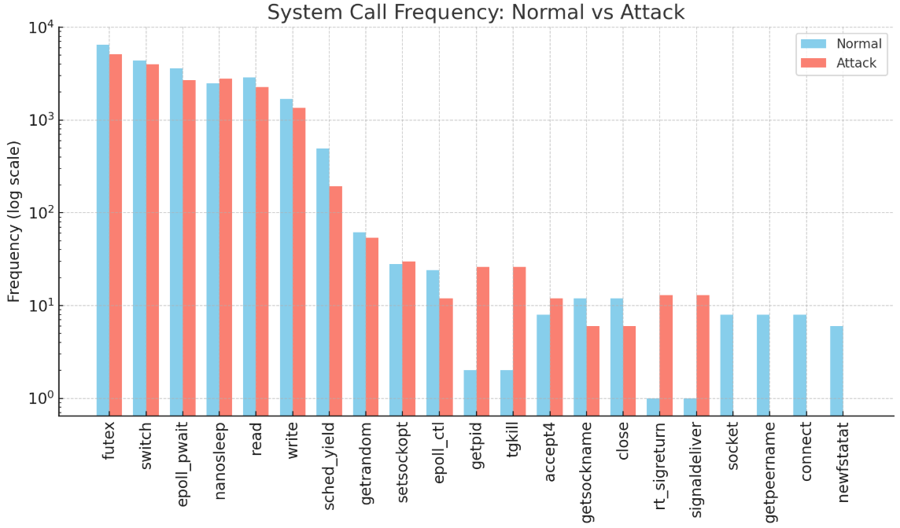

System call frequency Normal vs Attack – Directory Traversal


The increase in usage of error handling system calls is a clear indicative of the unsuccessful attack.
After that we have conducted sequence analysis of system calls and during normal operation, we can see that there is a tight wait loop using epoll_pwait() and it normally transitions to itself, futux(), and switch().  However, during the attack another pattern appears which is responsible for signal handling getpid() à tgkill() à signaldeliver() à rt_sigreturn().


| Aspect                                           | Normal Operation                          | During Attack Attempt                                  | Behavior Change / Detection Clue                        |
|--------------------------------------------------|--------------------------------------------|--------------------------------------------------------|---------------------------------------------------------|
| **read → read Sequences**                        | Common                                     | Still common but slightly fewer                        | Slightly fewer sustained reads                          |
| **write → write Sequences**                      | Frequent                                   | Less frequent                                          | Shorter/lighter responses                               |
| **New Connections (accept4)**                    | 8 times                                    | 12 times                                               | Slight increase → more client attempts                 |
| **socket, connect, getpeername Calls**           | Present                                    | Absent                                                 | Server avoided external connections under attack        |
| **getpid, tgkill, signaldeliver, rt_sigreturn**  | Very rare                                  | Repeatedly seen                                        | **Strong anomaly**: attack triggered signals             |
| **Transition Pattern**                           | Epoll ↔ Futex ↔ Read ↔ Write loops         | Same loops + signal handling                           | Signal sequences only during attack                     |
| **Signal Sequences (getpid → tgkill → ...)**     | None                                       | 12+ times                                              | Strong indicator of attack attempt                      |
| **Scheduling Patterns**                          | Normal sleep/yield loops                   | More frequent switch → nanosleep cycles                | More idle sleeping post-attack                          |
| **Processing Flow**                              | Regular request → process → response       | Likely early abort after malicious input               | Premature session termination signs                     |


After that, we have collected two datasets using Sysdig from the Teastore-auth service in two modes to understand the behavior of the pods; during normal operations and during attack.

 •	Normal operation data (collection.csv): 30,627 system call records
•	During-attack Brute Force data (collection1.csv): 33,136 system call records

Also in brute force attack, the normal workload persists in both scenarios. However, there is a notable increase in futux() and switch(). On the other hand, notable decrease on read() and lseek(). Also, there is an introduction gettid() and sysinfo() which indicate an increase in querying threads and system resource.


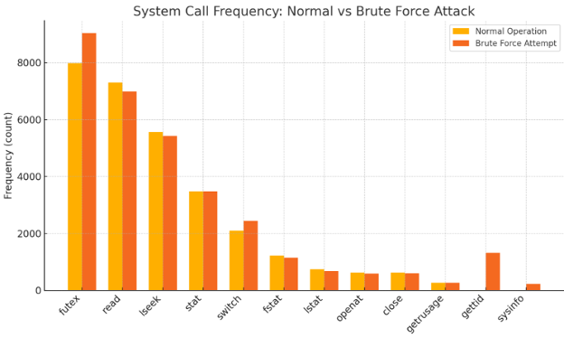

System call frequency Normal vs Attack – Brute Force

The increase in synchronization (futux) context switching (switch) and querying thread ids the system resource (gettid, sysinfo) indicate that the service is under unusual load. 
For sequence analysis, the introduction gettid() -> gettid() and sysinfo() -> sysinfo() indicate that system is experiencing abnormal load.


| Transition (2-gram)            | Normal Frequency | Attack Frequency | Behavior Change / Interpretation                                  |
|--------------------------------|------------------|------------------|-------------------------------------------------------------------|
| **futex → futex**              | ~5,800           | ~6,500           | Increased thread synchronization under load                      |
| **read → read**                | ~4,400           | ~3,800           | Fewer repeated reads – shorter session per login attempt          |
| **lseek → lseek**              | ~2,700           | ~2,200           | Slight drop – fewer file pointer moves under stress               |
| **futex → switch**             | ~1,800           | ~2,000           | More frequent context switches following futex waits              |
| **switch → futex**             | ~1,800           | ~2,100           | More threads waking into futex waits                              |
| **gettid → gettid**            | ~7               | ~1,100           | **Strong signal**: burst of thread ID lookups (per login attempt) |
| **sysinfo → sysinfo**          | 0                | ~120             | Repeated system status polling (stress signal)                    |
| **recvfrom → recvfrom**        | ~50              | ~60              | Slight increase – more incoming request reads                     |
| **sendto → sendto**            | ~100             | ~70              | Slight drop – possibly shorter error responses                    |
| **switch → nanosleep**         | Low              | Moderate         | Suggests short pauses or rate limiting under attack               |
| **read → futex**               | Moderate         | Moderate+        | Slightly more thread waiting after reads (e.g., lock for auth check) |
| **accept → fcntl**             | 0                | Present (~10)    | Socket configuration only during attack                           |
| **clone → set_robust_list**    | 0                | Present (~4)     | Thread creation and setup only under attack                       |


### ** 7.3.5 Implementation of ML model**

From the previous section we understood that there are different behaviors during normal operations vs during attack. We can use an ML model to help detect these behaviors. 
There is a limitation in finding a labeled dataset specific for system calls and for microservice applications, thus we chose the autoencoder as unsupervised ML model. We considered the system calls sequence as our main feature for the model. Below is the diagram that represents the model.

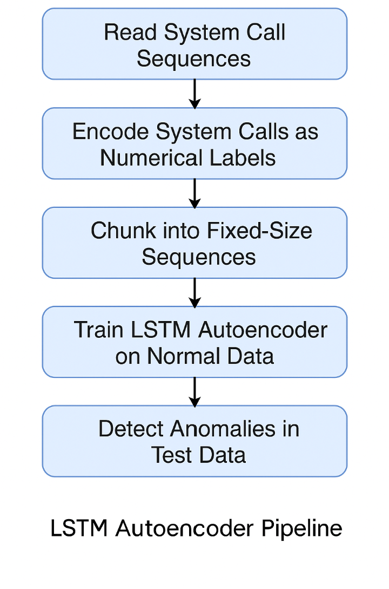

LSTM Autoencoder flow

```python
import pandas as pd
import numpy as np
from sklearn.preprocessing import LabelEncoder
import torch
import torch.nn as nn
from torch.utils.data import DataLoader, TensorDataset

train_path = "collection_normalTeastore_Auth.csv"  
test_path  = "collection_Teastore_Auth_BruteForce.csv"    

train_calls = pd.read_csv(train_path, header=None)
test_calls  = pd.read_csv(test_path,  header=None)

le = LabelEncoder()

all_calls = pd.concat([train_calls, test_calls], axis=0)
le.fit(all_calls)

train_labels = le.transform(train_calls)
test_labels  = le.transform(test_calls)

SEQ_LEN = 256

def chunk_sequence(labels, seq_len):
    total_labels = len(labels)
    remainder = total_labels % seq_len
    if remainder != 0:
        labels = labels[: total_labels - remainder]
    sequences = np.array(labels).reshape(-1, seq_len)
    return sequences

train_sequences = chunk_sequence(train_labels, SEQ_LEN)
test_sequences  = chunk_sequence(test_labels, SEQ_LEN)

print(f"Total training calls: {len(train_calls)} -> Training sequences: {train_sequences.shape[0]} of length {SEQ_LEN}")
print(f"Total test calls: {len(test_calls)} -> Test sequences: {test_sequences.shape[0]} of length {SEQ_LEN}")

train_tensor = torch.tensor(train_sequences, dtype=torch.long)
test_tensor  = torch.tensor(test_sequences, dtype=torch.long)

batch_size = 64
train_dataset = TensorDataset(train_tensor)
train_loader = DataLoader(train_dataset, batch_size=batch_size, shuffle=False)

device = torch.device("cuda" if torch.cuda.is_available() else "cpu")
print("Using device:", device)

class LSTMAutoencoder(nn.Module):
    def __init__(self, num_classes, embed_dim=16, hidden_dim=64):
        super(LSTMAutoencoder, self).__init__()
        self.embedding = nn.Embedding(num_classes, embed_dim)
        self.encoder_lstm = nn.LSTM(embed_dim, hidden_dim, batch_first=True)
        self.decoder_lstm = nn.LSTM(hidden_dim, hidden_dim, batch_first=True)
        self.output_layer = nn.Linear(hidden_dim, 1)
    def forward(self, x):
        batch_size, seq_len = x.size()
        x_embed = self.embedding(x)                      
        _, (h_n, c_n) = self.encoder_lstm(x_embed)       
        decoder_inputs = torch.zeros(batch_size, seq_len, self.decoder_lstm.input_size, device=x.device)
        decoder_out, _ = self.decoder_lstm(decoder_inputs, (h_n, c_n))   
        out = self.output_layer(decoder_out)             
        out = out.squeeze(-1)                            
        return out

num_classes = len(le.classes_)  
model = LSTMAutoencoder(num_classes, embed_dim=16, hidden_dim=64).to(device)

criterion = nn.MSELoss()
optimizer = torch.optim.Adam(model.parameters(), lr=0.001)

epochs = 200
for epoch in range(1, epochs+1):
    model.train()
    total_loss = 0.0
    for batch_data in train_loader:
        batch_seq = batch_data[0].to(device)        
        optimizer.zero_grad()
        recon_seq = model(batch_seq)
        loss = criterion(recon_seq, batch_seq.float())
        loss.backward()
        optimizer.step()
        total_loss += loss.item() * batch_seq.size(0)
    avg_loss = total_loss / len(train_dataset)  
    print(f"Epoch {epoch}/{epochs}, Training Loss: {avg_loss:.6f}")

model.eval()
with torch.no_grad():
    train_recon = model(train_tensor.to(device))
    train_errors = ((train_recon - train_tensor.to(device).float()) ** 2).mean(dim=1).cpu().numpy()
    threshold = train_errors.mean() + .2 * train_errors.std()
    print(f"Computed anomaly threshold (mean + 1.5*sigma) = {threshold}")

    test_recon = model(test_tensor.to(device))
    test_errors = ((test_recon - test_tensor.to(device).float()) ** 2).mean(dim=1).cpu().numpy()

    anomaly_flags = test_errors > threshold
    num_anomalies = np.sum(anomaly_flags)
    print(f"Number of anomaly sequences in test: {num_anomalies} out of {len(test_errors)}")

    for idx, is_anomaly in enumerate(anomaly_flags):
        if is_anomaly:
            print(f"Sequence {idx} flagged as anomaly with loss {test_errors[idx]:.6f}")

    results_df = pd.DataFrame({
        "sequence_index": np.arange(len(test_errors)),
        "loss": test_errors,
        "anomaly_flag": anomaly_flags.astype(int)
    })
    results_df.to_csv("test_anomaly_results.csv", index=False)
    print("Anomaly detection results saved to test_anomaly_results.csv")

```

## **Results and Discussion**

The rest ...


